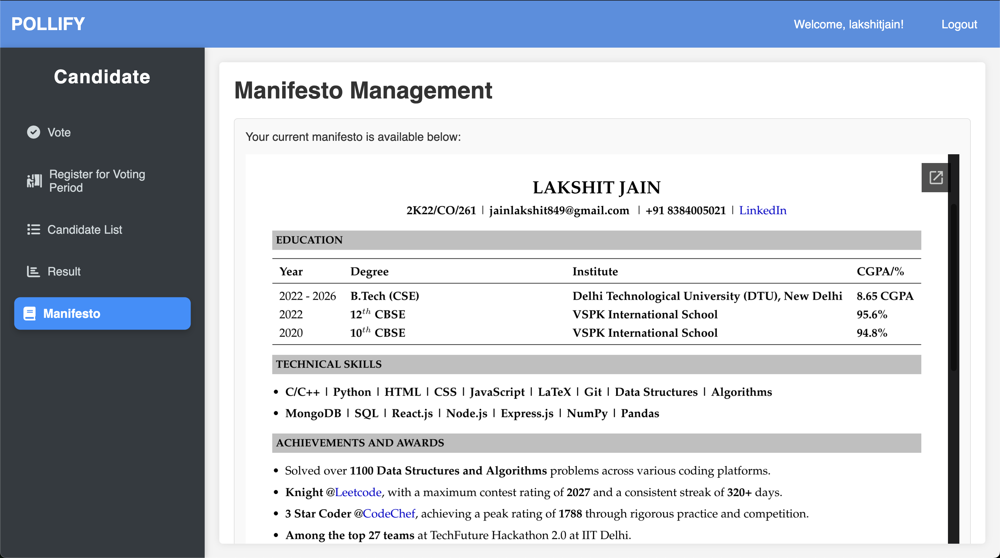

# Pollify

Pollify is an online voting system designed to simplify the electoral process through secure, intuitive features, two-factor authentication, and real-time data visualization.

---

## Table of Contents

1. [Project Overview](#project-overview)
2. [Features](#features)
3. [Database Setup](#database-setup)
4. [Apache Tomcat Setup](#apache-tomcat-setup)
5. [Setting Up Database Connection](#setting-up-database-connection)
6. [Running Pollify](#running-pollify)
7. [Screenshots](#screenshots)

---

## Project Overview

Pollify enables a smooth, structured election process, making it ideal for online voting scenarios. The system supports different types of users with distinct functionalities, ensuring an organized, secure election.

### User Roles
- **Admin**: Manages the voting period, candidates, and final result declarations.
- **Candidates**: Submits manifestos, applies for candidacy, and participates in elections.
- **Voters**: Casts votes during active periods and views election results.

### Core Functionalities
- **Voting Period Control**: Enables controlled start and end times for voting.
- **Real-Time Statistics**: Displays data on total votes, turnout ratio, and more.
- **Two-Factor Authentication (2FA)**: Sends OTP to email for user identity verification.
- **Result Visualization**: Post-election, displays winner with vote percentages and turnout statistics.

---

## Features

### 1. Voting Room & Period Management
   - **Controlled Voting Periods**: The voting room only opens during active voting periods, set by the admin.
   - **Real-Time Status**: Shows the current turnout ratio and total votes cast as the election progresses.
   - **One-User-One-Vote Enforcement**: Users can only vote once per election to ensure fairness.

### 2. Result Declaration
   - **Winner Calculation**: After voting concludes, the system calculates the winner based on vote count and percentage.
   - **Turnout Ratio**: Displays the turnout percentage to indicate the level of participation.
   - **Visibility Options**: Only the admin can initially view results, with an option to declare them publicly.

### 3. Two-Factor Authentication (2FA)
   - **OTP Verification**: An OTP is sent to users’ registered emails during signup to ensure they are real users.
   - **Time-Limited OTPs**: Each OTP has a 10-minute validity period to prevent misuse.
   - **Security Enhancement**: Ensures only verified users participate in voting.

### 4. Candidate Management
   - **Manifesto Submission**: Candidates can create, edit, and manage their manifestos.
   - **Candidacy Application**: Users can apply to become candidates for the current voting period.
   - **Admin Approval**: Only approved candidates are eligible to appear on the ballot.

### 5. Notifications and Announcements
   - **Registration Confirmation**: Users receive an email confirmation upon successful registration.
   - **Voting Period Announcements**: Admins can notify users about upcoming and ongoing voting periods.
   - **Result Notifications**: Admins can announce results, along with individual notifications for candidates.
   - **Win/Loss Alerts for Candidates**: Candidates receive personalized notifications about the outcome.

---

## Database Setup

### Step 1: MySQL Setup

1. **Create the Database**
   ```sql
   CREATE DATABASE pollify;
   USE pollify;

2. **Create Required Tables**

   - **`Users` table**:
     ```sql
     CREATE TABLE Users (
         id INT AUTO_INCREMENT PRIMARY KEY,
         username VARCHAR(100) UNIQUE NOT NULL,
         email VARCHAR(150) UNIQUE NOT NULL,
         password VARCHAR(255) NOT NULL,
         role ENUM('admin', 'voter', 'candidate') NOT NULL,
         status ENUM('pending', 'approved') DEFAULT 'pending',
         voted BOOLEAN DEFAULT FALSE,
         phone_number VARCHAR(20),
         otp_code VARCHAR(10),
         otp_expiry DATETIME,
         manifesto TEXT,
         created_at TIMESTAMP DEFAULT CURRENT_TIMESTAMP
     );
     ```

   - **`VotingPeriod` table**:
     ```sql
     CREATE TABLE VotingPeriod (
         id INT AUTO_INCREMENT PRIMARY KEY,
         start_time DATETIME,
         end_time DATETIME,
         is_active BOOLEAN DEFAULT FALSE
     );
     ```

   - **`Votes` table**:
     ```sql
     CREATE TABLE Votes (
         id INT AUTO_INCREMENT PRIMARY KEY,
         user_id INT,
         candidate_id INT,
         voting_period_id INT,
         vote_time TIMESTAMP DEFAULT CURRENT_TIMESTAMP,
         FOREIGN KEY (user_id) REFERENCES Users(id) ON DELETE CASCADE,
         FOREIGN KEY (candidate_id) REFERENCES Users(id) ON DELETE CASCADE,
         FOREIGN KEY (voting_period_id) REFERENCES VotingPeriod(id) ON DELETE CASCADE
     );
     ```

   - **`Results` table**:
     ```sql
     CREATE TABLE Results (
         id INT AUTO_INCREMENT PRIMARY KEY,
         voting_period_id INT,
         winner_candidate_id INT,
         total_votes INT DEFAULT 0,
         winner_percentage DECIMAL(5,2),
         turnout_ratio DECIMAL(5,2),
         start_time DATETIME,
         end_time DATETIME,
         declared_at TIMESTAMP DEFAULT CURRENT_TIMESTAMP,
         FOREIGN KEY (voting_period_id) REFERENCES VotingPeriod(id) ON DELETE SET NULL,
         FOREIGN KEY (winner_candidate_id) REFERENCES Users(id) ON DELETE SET NULL
     );
     ```

   - **`CandidateApplications` table**:
     ```sql
     CREATE TABLE CandidateApplications (
         id INT AUTO_INCREMENT PRIMARY KEY,
         user_id INT,
         voting_period_id INT,
         status ENUM('pending', 'approved', 'rejected') DEFAULT 'pending',
         submission_time TIMESTAMP DEFAULT CURRENT_TIMESTAMP,
         FOREIGN KEY (user_id) REFERENCES Users(id) ON DELETE CASCADE,
         FOREIGN KEY (voting_period_id) REFERENCES VotingPeriod(id) ON DELETE CASCADE
     );
     ```

3. **Create MySQL Events**

   - **Activate Voting Period**:
     ```sql
     CREATE EVENT activate_voting_period
     ON SCHEDULE EVERY 1 MINUTE
     DO
     UPDATE VotingPeriod SET is_active = TRUE
     WHERE start_time <= NOW() AND end_time > NOW();
     ```

   - **Deactivate Voting Period**:
     ```sql
     CREATE EVENT deactivate_voting_period
     ON SCHEDULE EVERY 1 MINUTE
     DO
     UPDATE VotingPeriod SET is_active = FALSE
     WHERE end_time <= NOW();
     ```

---

## Apache Tomcat Setup

1. **Download Apache Tomcat 9**  
   Download Tomcat 9 from the official website: [Apache Tomcat 9 Download](https://tomcat.apache.org/download-90.cgi).

2. **Clone the Pollify Repository**  
   Clone the `Pollify` GitHub repository into the `webapps` folder of your Apache Tomcat directory:
   ```bash
   git clone https://github.com/lakshitcodes/pollify.git /path/to/tomcat/webapps/pollify
3. **Create Database Credentials File**  
   Inside the directory `/pollify/WEB-INF/classes/com/pollify`, create a file named `DBCredentials.java` with the following code. Replace `"your_username"` and `"your_password"` with your actual MySQL credentials:

   ```java
   package com.pollify;

   public class DBCredentials {
       private static final String DB_URL = "jdbc:mysql://localhost:3306/pollify";
       private static final String DB_USER = "your_username";
       private static final String DB_PASS = "your_password";

       public static String getDbUrl() {
           return DB_URL;
       }

       public static String getDbUser() {
           return DB_USER;
       }

       public static String getDbPass() {
           return DB_PASS;
       }
   }
4. **Download Required Libraries**

   Place the following JAR files in the `lib` folder of your Apache Tomcat directory:
    - `servlet-api.jar`
    - `mysql-connector.jar`
    - `javax.mail.jar`
    - `activation-1.1.1.jar`
    These libraries are essential for servlet handling, MySQL database connectivity, and email functionality.

5. **Compile Java Files**

   If Apache Tomcat is installed in the `Downloads` folder of your macOS system, run the following command to compile all `.java` files in `pollify/WEB-INF/classes/com/pollify`:
   ```java
   javac -cp "/Users/lakshitjain/Downloads/apache-tomcat-9.0.96/lib/*:/Users/lakshitjain/Downloads/apache-tomcat-9.0.96/lib/mysql-connector-j-9.0.0.jar:/Users/lakshitjain/Downloads/apache-tomcat-9.0.96/lib/activation-1.1.1.jar" /Users/lakshitjain/Downloads/apache-tomcat-9.0.96/webapps/pollify/WEB-INF/classes/com/pollify/*.java

6. **Start Apache Tomcat**

    Navigate to the `bin` directory of your Apache Tomcat installation and start the server to deploy the Pollify application:

    ```Terminal
    cd /path/to/tomcat/bin
    ./startup.sh

7. **Access Pollify**

    Open a web browser and go to `http://localhost:8080/pollify` to access the Pollify application.
   
---

## Running Pollify

Once the Apache Tomcat server is up and running, you can access Pollify at `http://localhost:8080/pollify`. Register as a user or log in as an admin to explore the various functionalities of the system.

---

## Screenshots

1. **Register Page**


2. **OTP Verification Page**


3. **Login Page**


4. **Admin Dashboard**


5. **Declare Result Page**


6. **Calculate Result**


7. **Result of a Voting Period**


8. **Page for Approving Candidate**


9. **View Voting Periods**


10. **Candidate Dashboard**


11. **View Active Polls**


12. **Vote in Poll**


13. **Results Page**


14. **View Manifesto**


15. **Update and Delete**


16. **Voter Dashboard**


17. **Candidate List**


18. **Apply for Candidate**


19. **OTP Mail**


20. **Candidate Approval Mail**


21. **Rejection Mail**


22. **Result Declaration Email**
